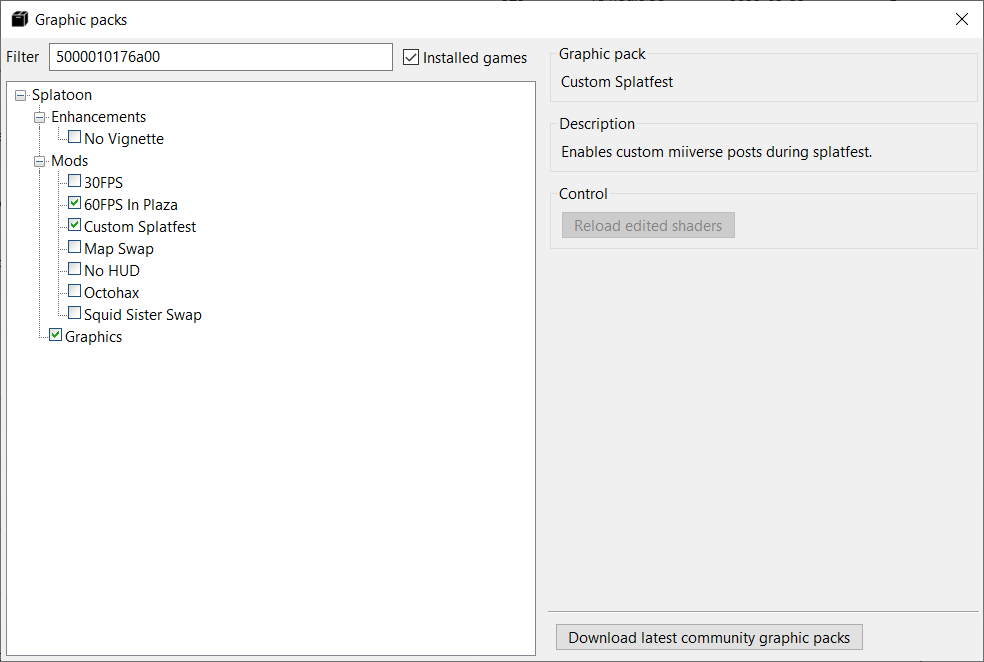
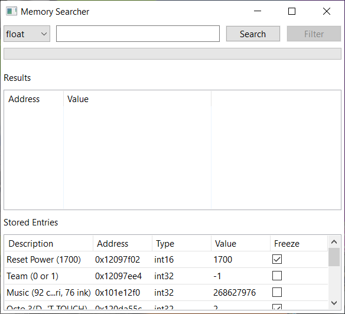

# Cemu Instructions

How to use SFDL for Cemu.

If you're encountering an error or any of the steps are unclear, check the [Troubleshooting guide](https://github.com/ShadowDoggo/sfdl_files/blob/main/SFDL/Troubleshooting.md) or ask for help in the assistance channel.

## Online files

In order to participate in the splatfests, you'll need to dump the online files from your Wii U using [this](https://cemu.cfw.guide/online-play.html) guide. Pretendo servers **do not** work with the splatfests at the moment.

## Downloads

### Windows:

The Python version requires Python 3.10 or newer and the [requests](https://pypi.org/project/requests/) module.

[Executable](./SFDL_Cemu.exe)

[Python script](./sfdl_for_cemu_win.zip)

Extract these to the root of your Cemu folder (where Cemu.exe is).

### Linux (beta):

Distros tested so far: Ubuntu, Mint.

Available only as Python script. Requires Python 3.10 or newer and the [requests](https://pypi.org/project/requests/) module.

[Python script](./sfdl_for_cemu_linux.zip)

## Installing the Splatfest

### Step 1:

Run SFDL for Cemu.

### Step 2:

Click the Install Files button. If nothing went wrong, the app will install the splatfest and restart.

## After installing

### Step 1:

Open Cemu, right click on Splatoon and select Edit graphic packs.

Under the Mods section, enable the Custom Splatfest graphic pack.

### Step 2:

Launch Splatoon. The splatfest should now be active.

### Step 3:

Before going into the lobby, open Tools > Memory searcher, make sure that the power reset entries are enabled and leave the window open.

You can now participate in splatfest matches! Get your splatfest team role and head over to the matchmaking channel.

## Uninstalling the Splatfest

Click the Uninstall Files button. Your game should now be back to normal.

To restore your previous memorySearcher file, copy the 00050000(titleid).bak file from the sfdl folder to the memorySearcher folder and remove the .bak extension.

##

© 2022 Shadow Doggo.
