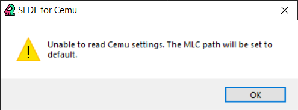

# Troubleshooting Guide

A small guide to help you troubleshoot common errors you may encounter in SFDL for Cemu. If you have any questions or need further assistance, you can ask for help in the server's assistance channel.

## Cemu related errors

### Splatoon causes Cemu to crash after uninstalling the splatfest files:

If you're using cemu 1.27 or older, you'll need to manually reinstall the boss files after uninstalling the splatfest. This is due to a bug that was fixed in 2.0.

You can download the clean boss files from [here](https://github.com/ShadowDoggo/sfdl_files/tree/main/Files%2FClean). Extract them to your mlc01 folder.

### Unable to read Cemu settings/Unable to automatically detect region:

 

This error means the app is unable to read Cemu's settings file. This is also usually caused by the app not being in the root of your Cemu folder. If it still fails, you can manually set the region and a custom MLC path in the settings.

## Install errors

### Install failed. No such file or directory: '/...':

This error means the app couldn't install the splatfest files. It can be caused by an incorrect region or MLC path, the app not having write permissions to the MLC folder, the boss data folder not existing, or by something else blocking access to the files. Try launching the game with online mode enabled and entering the lobby to create the boss data. Close Cemu and check if anything else is accessing the mlc folder before installing the files.

### Write permissions:

If the app is still unable to install the files, it probably means it doesn't have write permissions to the MLC and memorySearcher folders. Running the app as admin should resolve these issues.

Alternatively, you can check the permissions for both of the folders to make sure the app can write to them.

## Download errors

### HTTP Errors:

These errors probably mean that GitHub/the API is down or having server issues. You'll have to wait until the issue is resolved, or install the files manually.

### Urlopen error:

These errors mean that you don't have an internet connection, or the app is blocked by your firewall/antivirus. Running the app as admin should fix this issue. If not, you'll need to whitelist it in your firewall settings.

## Other errors

### Unable to create config file:

This error means the app doesn't have write permissions to the Cemu folder. If it's in Program Files or any other location that requires admin permissions to write files, you'll need to run the app as admin.

### Windows Defender protected your PC:

The app's executable is unsigned, so Windows Defender detects it as suspicious. To get around this, click More info > Run anyway.

### Unhandled exception in script:

This is a rare error that occurs if something went really wrong. It can be caused by a corrupted executable, weird permission issues, a broken VC++ instalation and other issues with your system. Try deleting the app's executable and running the updater again.

If the message says anything about "readconfig", delete the app's config file (sfdl/config.cfg).

### Splatoon save or memory searcher file got wiped:

The app automatically backs up your save and memory searcher files in case anything goes wrong, if you have the option enabled. To restore the save, right click on Splatoon > Save directory > user > ID > delete the old save > copy the save.dat.bak from the sfdl folder > remove the .bak extension. To restore the memory searcher file, remove the old .ini file from the memorySearcher folder > copy the .ini.bak file from the sfdl folder to the memorySearcher folder > remove the .bak extension.

##

© 2022 Shadow Doggo.
